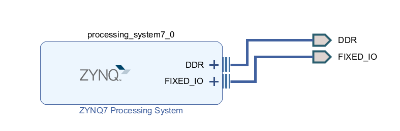
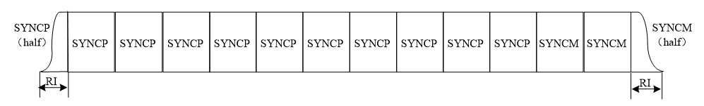
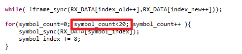
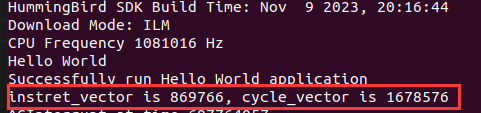
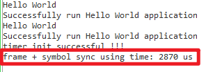

# A9处理器同步模块测试

## 一、PL端工程

本次主要是在PS端进行测试，PL端只需要搭建最小系统即可。

## 二、前导

前导由10.5个$$SYNCP$$与2.5个$$SYNCM$$组成

$$
SYNCM = - SYNCP
$$
前导开始的$$0.5$$个$$SYNCP$$是$$SYNCP$$的后半部分，最后的$$0.5$$个$$SYNCM$$是$$SYNCM$$的前半部分。

## 三、结果

符号同步计算20次

e203结果

A9处理器结果

